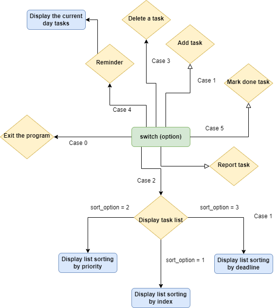
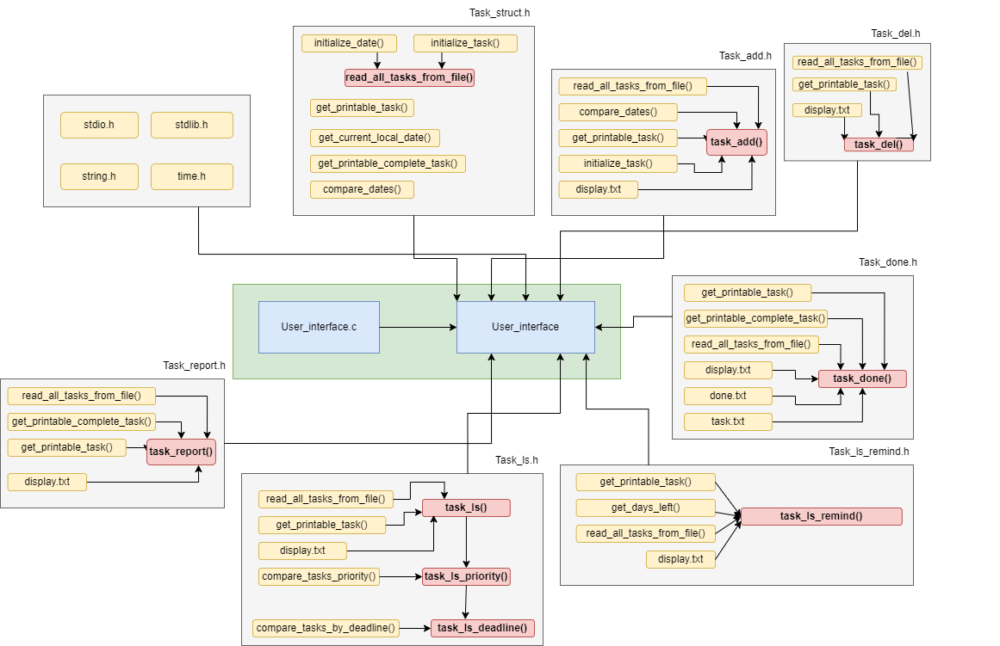

# Task management tool
<!-- TABLE OF CONTENTS -->
<details>
  <summary>Table of Contents</summary>
  <ol>
    <li>
      <a href="#introduction">Introduction</a>
    </li>
    <li>
      <a href="#technical-overview-and-overall-flowchart">Technical Overview and Overall flowchart</a>
    </li>
    <li><a href="#usage">Usage</a></li>
  </ol>
</details>


<!-- ABOUT THE PROJECT -->
## Introduction

For the project submitted to Cinamon AI, I conducted a management product called Tasks Management Tool (TMT) with the aim to help users efficiently manage and organize their tasks. TMT program is designed to be compatible only with the Windows operating system, making use of C libraries such as: “stdio.h”, “stdlib.h”, “time.h”, “string.h”, and “windows.h” to execute functions and create interfaces. 

My target users for TMT are students and professionals who need a reliable and customizable tool to manage their daily tasks with super-fast runtime and high precision. As a student, I fully observe and sympathize with students’ obstacles in organizing, classifying, and keeping pace with their tasks inside and outside schools when there are often an overwhelming number of tasks to handle every day. Therefore, I came up with a task management tool that can help individuals and teams to organize their work, set priorities, track progress, and remind them of upcoming deadlines which can ultimately increase productivity and efficiency. I also want our tool to operate most rapidly when the functions are called to implicitly save the users’ time while the outputs are controllable by users following their needs and orders. 

The program's architecture follows a modular design, making it easy to maintain and extend. It comprises three main modules:
1.	User Interface Module: This module is responsible for receiving user input and displaying output through note pad. It provides a command-line interface for users to interact with the system.
2.	Task Management Module: This module is responsible for managing the tasks. It provides the necessary functions for adding, displaying, editing, deleting, searching, and sorting tasks.
3.	Data Storage Module: This module is responsible for storing and retrieving tasks from the system's storage. It uses a simple file-based storage system to store tasks' details.

This project is done with the help of my teammates in university in our project for Computer System Programming Course.


<!-- GETTING STARTED -->
## Technical Overview and Overall flowchart

My product's principle is to provide a comprehensive and efficient task management program to help users manage their tasks effectively. The program includes features such as adding new tasks, displaying and sorting tasks, deleting tasks, reminding tasks, marking tasks as done, and generating task reports. These functions work together to provide users with a complete task management solution that is easy to use and customizable to their individual needs. The program is designed to help users stay organized, prioritize tasks, and meet deadlines, thereby increasing their productivity and reducing stress. The code behind the program is built using efficient algorithms that ensure speedy execution and accurate results.

<p align="center">
  
</p>

<p align="center">
  Fig1: Flow chart of the program
</p>


<p align="center">
  
</p>

<p align="center">
  Fig2: My module architecture
</p>

## Usage
To use the Task Management Tool (TMT), follow the instructions below:

1. Clone the repository to your local machine:
   ```sh
   git clone https://github.com/Akirahai/Task_management_tool_Hai.git
   ```

2. Cd to the output file
   ```sh
   cd output
   ```
3. Run the user_interfacec.exe
   ```sh
    & .\'User_interface.exe'
   ```

4. Follow the on-screen instructions to navigate through the different options and interact with the program. Use the provided menu options to add tasks, display tasks, delete tasks, mark tasks as done, generate reports, and more.

5. Watch the video preview to get a visual demonstration of the TMT program's features.
[How to use](https://drive.google.com/file/d/1Rg7ZsRUGBDR-FkWzPcFc-wchMr3b08sz/view?usp=drive_link)


6. For a detailed explanation of the algorithms used in the important functions of the TMT program, refer to the PDF document. You can access the document here [Algorithms](Algorithms.pdf)

Please note that the above steps are general guidelines, and you may need to adapt them based on your specific development environment and requirements.

Enjoy using the Task Management Tool (TMT) to efficiently organize and manage your tasks!